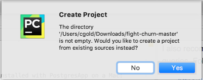
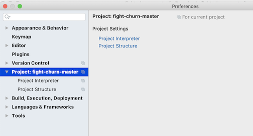
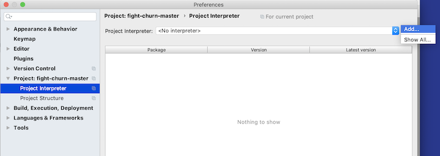
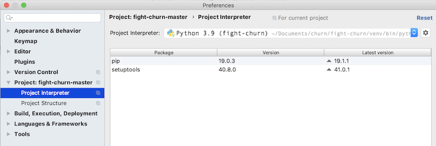
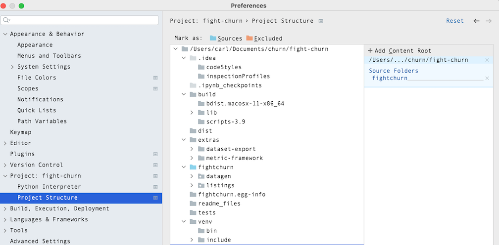
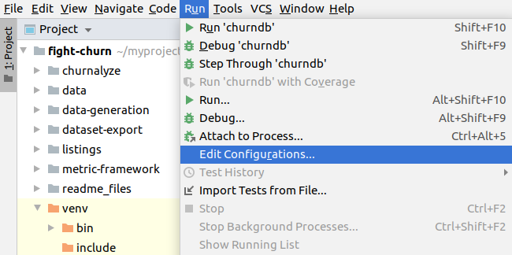
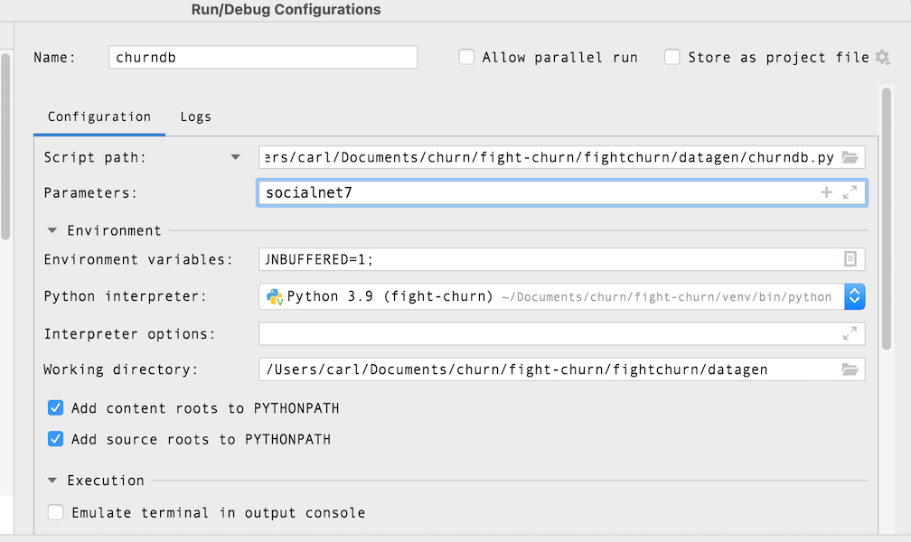
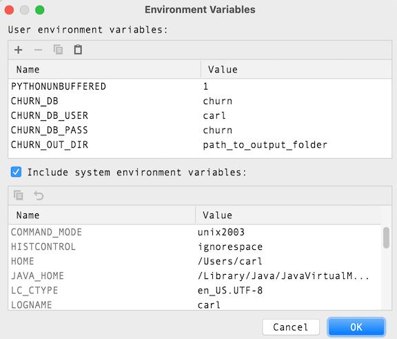
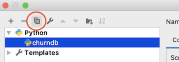

<a name="pycharm"/>

# Python IDE Setup

If you are a developer who wants to work on the code directly, I recommend installing an Integrated Development Environment like PyCharm. PyCharm **Community Edition** was used by the author to write and run
all the code for the book, so this README will include how to setup PyCharm (this is especially useful if you 
are new to Python, since an IDE can take care of some of the setup for you...)

* https://www.jetbrains.com/pycharm/download

#### 1.2.2 Pycharm Setup

After you have cloned this repository

1. launch PyCharm and go to the menu *File* / *New Project*
1. In the file section window, select the folder for the repo.  Leave it set to "Create New Virtual environment for this project"
1. Click **Create**
1. It should say "The directory ... is not empty.  Would you like to create a project from existing sources?"  Click Yes



---

##### 1.2.2.1 Setup Python Project in Pycharm

You should create a Python "virtual environment" for the project (I won't try to go into details here,
but this allows you to install the packages used for the repo without interfering with anything else
on your system).  

In PyCharm, select from the menus: 

- Mac:  *Pycharm*  / *Preferences...*  and go to the area for *Project*
- Windows:   *File*  / *Settings...*  and go to the area for *Project*



If you click on the gear wheel to the right of where it says <No Interpreter> you have the option to add
a new one...



It will look something like this:


And after you click **Okay** it will take several seconds to create the virtual environment, and
then it should look like this:



You will add more packages in a minute, but first finish with the project setup by going to the
*Project Structure* section of the preferences. If it starts out blank, and click on "Add Content Root"


Then select the root folder of the downloaded code. You should see some like this (at your own source code location):


Select the `fightchurn` folder that contains python source code, and click on the button *Sources*
(with the blue folder next to it):


When you are done your project preferences should look like this:



---

##### 1.2.2.2 Installing Python Package Requirements in Pycharm

Now that you have created a Python project you can easily install the
required packages.  

1. Start by opening the Python file *fightchurn/datagen/churndb.py* . At this point you are not going to use it, but PyCharm might not do the requirements for you if you don't have a Python file open. (Thats actually a weird PyCharm gotcha.) At this point it should give you a bunch of message about Installing requirements at the top. 
2. Now, go ahead and opena the file *requirements.txt* in the root project folder - these are the packages you will install.
3. 
4. Notice that at the top it says: *Install requirements* - click on that and the click
   **Install** in the dialog that comes up. Note that you have to be connected to the internet for
   this to work, and it will take several minutes for all the packages to be downloaded 
   and installed.


---

##### 1.2.2.3 Creating Run Configurations and Setting Database Environment Variables

A lot of the python code depends on access to the database you created for the churn data.
You will set environment variables that will hold your database and login information, so that
it does not have to be hard coded.  The easiset way to do this in PyCharm is to
set environment variables when you create a Run Configuration for the executables.

Here is one example of creating a run configuration for one of the programs: If you have not created any Run Configurations yet, you start with menu options `Run > Edit Configurations` as shown in pic below:




In the Run/Debug Configuration dialog click the **+**  then **Python** to make a new python script configuration.


You will get an empty configuration, and the first thing to do is click on the Folder icon in the 
script path text box and pick the script path.  The first script everyone will need to run is 
*fightchurn/datagen/churndb.py*, which creates a schema for an analysis.  After selecting this script, your
configuration should look like this, with both the script path and the working directory set to 
wherever the script is on your system:



The next step is to add the environment variables, by clicking on the *Browse* button at the end
of the environment variables text box:


That button launches a dialog to add the environment variables.  You need to add three:

1.  CHURN_DB  : the name of the database for your churn analysis schemas (step 1.2.1 above)
1.  CHURN_DB_USER : the user name to login to the database
1.  CHURN_DB_PASS : the password to login to the database
1.  CHURN_OUT_DIR : the location of a directory where you want to write program output

After setting these, your environment variable dialog should look something like this:



Select **OK** and save all the configuration changes.  I'll say more about running this script in the 
next section on Data Loading / Creation.

------

##### 1.2.2.4 Duplicating Run Configurations

For creating additional Run configurations, note that PyCharm allows you to duplicate 
and modify an existing configuration.  So when you want to make another script with the same environment
variables open the Configuration Dialog, now by clicking on the run configuration drop down then selecting 
**Edit Configuration**


Now choose to duplicate your existing Run configuration:



This will make another configuration the same as the existing one - you can rename it and reset the 
path to a different script, keeping the environment variables you already setup.

- Duplicating run configurations saves you the trouble of re-entering the environment variables

One last thing: After creating the Run Configuration you actually run a script in PyCharm
using menu configurations `Run > Run 'churndb'` as shown in pic below:


---

---

<a name="data"/>

### 1.3 Data Loading / Creation

To run any of the code in the book you need to get some data loaded into your database.
There are two types of data you need:

1. Subscriptions (or the equivalent) for purchase of the product
1. Customer Behavior Events using the product

For more detailed information about what the data has to look like you can see these on-line
resources:

* [Subscription Data (and Churn Calculation)](http://fightchurnwithdata.com/how-to-calculate-churn-with-sql/)
* [Event Data (and Metric Calculation)](http://fightchurnwithdata.com/user-metrics-101/)

 Or, see Chapter 2 (for Subscriptions) and Chapter 3 (for Events) in the book. 
 For setup purposes (the focuse here) there are two options for getting this kind of data:

1. You already have data of your own - this is the option for anyone who already works on an online product or service
1. You can generate a simulated data set from a random model - this is the option for most students or people doing this for training purposes 

Note that unfortunately there is no publicly available *real* data at this time. Subscription and
customer data like this tends to be very sensitive information for the companies that hold it
and so far there are no offers of data that can be made publicly available. (**If you have
such data that you would be willing to make publicly available please contact the author.**)

---

#### 1.3.1 Schema Creation

Regardless of where you get your data from, you need to create the database schema and tables that it
to hold it.  There is a python script in the folder *data-generation* for this.  If you have been
following the instructions above then you have already made a Run Configuration for the script in
PyCharm, or prepared the Jupyter notebook `churn_db_sim.ipnyb`.  There's just one more thing to do: name the schema that you will create.

1. Open the file *fightchurn/datagen/churndb.py*
1. Edit the schema name in the file to the name you want
   1. If you are loading your own data, name it whatever you want
   1. If you are generating simulated data, leave it set to the name **socialnet7** which is the default model for simulation
1. Run the script using PyCharm or a Jupyter Notebook, as described above.

If everything works as planned you should see something like the following output:

```
/Users/user_name/fight-churn-master/venv/bin/python /Users/user_name/fight-churn-master/fightchurn/datagen/churndb.py
Creating schema test (if not exists)...
Creating table event (if not exists)
Creating table subscription (if not exists)
Creating table event_type (if not exists)
Creating table metric (if not exists)
Creating table metric_name (if not exists)
Creating table active_period (if not exists)
Creating table observation (if not exists)

Process finished with exit code 0
```


A new schema and tables were created in your PostgreSQL database, which you can confirm by looking
in PgAdmin:


If you made it this far then congratulations!  You just ran your first bit of the fight-churn code.

---

#### 1.3.2 Generating Simulated Data

If you don't have your own data to analyze then you should use the simulator program to create a 
realistic (enough) simulation of subscription, churn and event data for you to run the book code examples on.
Code for generating artificial data to run the code is in the directory `data-generation`.  In
the near future there will be a blog post explaining how the simulation works, and the instructions
here are limited to simply running the simulation.

*  For *PyCharm*, follow the instructions in section 1.2.2.4 and duplicate and modify the run configuration for `fightchurn/datagen/churndb.py` (which you ran above) to make a *new* run configuration  for the script `fightchurn/datagen/churnsim.py` (which you are about to run.)  
*  For *JupyterNotebooks* you should have already run the first 3 cells of the notebook `churn_db_sim.ipynb`. The simulation command is in the 4th cell of the notebook: `run churnsim.py`

If this is your first time following these instructions, just run it.  You should start to see output like this:

```
/Users/user_name/fight-churn-master/venv/bin/python /Users/user_name/fight-churn-master/fightchurn/datagen/churnsim.py
Matrix is not positive semi-definite: Multiplying by transpose

Creating 10000 initial customers for 2019-01-01 start date
Simulated customer 0: 5 subscription, 10243 events @ 2019-05-21 06:00:01.611085
Simulated customer 1: 5 subscription, 10076 events @ 2019-05-21 06:00:01.805228
Simulated customer 2: 5 subscription, 11501 events @ 2019-05-21 06:00:02.034017
Simulated customer 3: 5 subscription, 11643 events @ 2019-05-21 06:00:02.250260
Simulated customer 4: 5 subscription, 9869 events @ 2019-05-21 06:00:02.433102
...

```

There will be more like this and the whole process will take from around 10-30 minutes depending on the speed of your
system (**so this may be a good time to go for a coffee break, lunch, nap, etc.**.) Please pardon the delay,
 but the program is simulating the subscriptions, behavior and churn of more than 10,000 customers over 6 months time. The results of the simulation are  all inserted into the  database tables `subscription` and `event`. (There is no data for churns yet : you will derive that as part of the  analysis process described in the book chapters 2 and 4.)  You can (and should) confirm the results of the data  simulation by querying the database directly, and you don't have to wait for the simulation to complete (so this is  actually a good next step to take while you are waiting...)

```
churn=# select count(*) from socialnet7.subscription;
 count 
-------
  52048
(1 row)

churn=# select count(*) from socialnet7.event;
  count  
---------
 34198616
(1 row)

churn=# 

```

Those are examples of what the numbers will look like when the simulation is over; yours won't look exactly like that,
 because its a random simulation and the results are different every time.  But it should be a similar overall number.
 If you check the count midway through it will be less of course.
(If you don't know how to launch a SQL prompt on your launch the PostgreSQL app and double click on
the database.  Mine doesn't actually launch the terminal directly, but it points in the right direction....)


Great!  Now you have the data you need to run the code and learn the techniques in the book.

---

#### 1.3.3 Loading Your Own Data (If you have it)

If you have your own data that you want to analyze then you need to load it into the `subscription` and 
`event` tables of the churn analysis schema. I will outline the basic steps here, but I'm going to assume
that if you work in an organization that has its own churn data to analyze then either you know how to
export and import the data already (probably better than I could tell you), or you can get support from
someone else in your oganization.  That said, for those of you have your own data but don't have a better
 resource to turn to for how to load it, the process you will follow is:

* Export the data from your equivalent of a `subscription` table. If you use Zuora to track your subscriptions, this
  is actually the `rate_plan_charge` object.  If you use Salesforce, this is may be the `Opportunity` table (where the
  opportunity was won.)   Each subscription record must have an account identifier, a start date 
  and a price, quoted in Monthly Recurring Revenue (MRR).  Terminated (churned) subscriptions must have the end date.  
  If you have other fields in the churn analysis subscription table (product name, units and quantity, billing frequency) 
  then you can export these as well, or else export a NULL in those positions (which will make the import simpler.)
  Follow the order in the churn analysis subscription table:
    1. id : integer
    1. account_id : integer
    1. product : text
    1. start_date : date
    1. end_date : date
    1. mrr : double
    1. quantity : double
    1. units : text
    1. bill_period_months : integer

* Export the data from your equivalent of an `event` table, and from whatever table names the event types (assuming
  there is a code name table separate from the event table.  Every event must have an account identifier, a timestamp,
  and a type.  The required fields for the events are:
    1. id : integer
    1. event_time : timestamp
    1. event_type_id : integer
* You can and should also export whatever additional data fields you have for your events that you think
  are important (amounts viewed or consumed, prices, content categories, etc.) Start by updating the the event table
  schema in `fightchurn/datagen/schema/create_event.sql` and recreate the table including your fields (You will have to 
  drop the existing table that you created in step 1.3.1.)

If you know how to import and export PostgreSQL data using the command line then have it.  Personally I did 
it with the PgAdmin Import/Export GUI, which you launch by command clicking (right clicking) with your mouse on the
listing for the table you want to import into:


[(top)](#top)  

---

---

---

<a name="examples"/>

## 2 Running the Code from the Book Listings

You can run the book listings with the python script `fightchurn/listings/run_churn_listing.py`.

* This script reads SQL and Python source code, and either
  binds variables (for SQL) or passes parameters (for Python) and executes the code.  
* The code (listings from the book) are in the folders `chapN` under the listings directory.
* Exactly what listings to run and what parametes are used are set in JSON files in the directory `fightchurn/listings/conf`.

So you can use this utility as you go through the book - if you want to actually run the code
from any listing on your local database, this is the easiest way to do it.

[(top)](#top)  

---

<a name="runlist"/>

### 2.1 Running a Listing

* For *PyCharm*, start by making a Run Configuration for the script `fightchurn/listings/run_churn_listing.py`, 
  following the instructions in Section 1.2.2.4 (duplicate and modify one of your old configurations.)


The script is preset to run the first code listing, listing 2.1 from chapter 2, for the
simulated data set `socialnet7`.  If you have created a simulated dataset named `socialnet7` as described
in section 1.3.2 you can run your configuration as is and you should see a result like this:

```
/Users/user_name/fight-churn/venv/bin/python /Users/user_name/fight-churn/fightchurn/listings/run_churn_listing.py

Running chap2 listing listing_2_1_net_retention
SQL:
----------
set search_path = 'socialnet7'; with 
date_range as (    
	select  '2019-03-01'::date as start_date, '2019-04-01'::date as end_date
), 
start_accounts as    
(
	select  account_id, sum (mrr) as total_mrr    
	from subscription s inner join date_range d on
		s.start_date <= d.start_date    
		and (s.end_date > d.start_date or s.end_date is null)
	group by account_id    
),
end_accounts as    
(
	select account_id, sum(mrr) as total_mrr      
	from subscription s inner join date_range d on
		s.start_date <= d.end_date    
		and (s.end_date > d.end_date or s.end_date is null)
	group by account_id    
), 
retained_accounts as     
(
	select s.account_id, sum(e.total_mrr) as total_mrr     
	from start_accounts s 
	inner join end_accounts e on s.account_id=e.account_id  
	group by s.account_id    
),
start_mrr as (    
	select sum (start_accounts.total_mrr) as start_mrr from start_accounts
), 
retain_mrr as (    
	select sum(retained_accounts.total_mrr) as retain_mrr 
from retained_accounts
)
select 
	retain_mrr /start_mrr as net_mrr_retention_rate,    
	1.0 - retain_mrr /start_mrr as net_mrr_churn_rate,    
	start_mrr,    
	retain_mrr
from start_mrr, retain_mrr

----------
RESULT:
Record(net_mrr_retention_rate=0.96039603960396, net_mrr_churn_rate=0.0396039603960396, start_mrr=1008.99, retain_mrr=969.030000000001)

Process finished with exit code 0
```

The first line shows you what chapter and listing are being run.  Next it shows the SQL being run (this is a SQL
listing).  The final line prints out the result - the net retention rate, calculated with the SQL.  Because the data
was randomly simulated your result on the last line won't be exactly the same as that one, but it should be similar.

One way you  can change what the script will run for by simply editing the constants in the "main" portion 
**at the bottom of the file**.  Note these variables:

* `schema` : the name of the churn data schema to run on
* `chapter` : the chapter to run a listing from
* `listing` : the number of the listing to run

The most common thing you will do is run a different listing on the same schema and chapter, so you would edit this line:

`--listing=1`

to whatever listing you want. So for example, to run listing 2.2 you can change the variable to:

`--listing=2`

Alternatively, the script accepts command line parameters.  To run this way, provide the following three parameters 
(all required) and it will use those instead of the hard coded constants:

1. The first command line parameter is the schema
1. The second command line parameter is the chapter number
1. The third command line parameter is the listing number 

**Note:**
If you want to run listings from the command line, you also need to setup your Python virtual environment
and add the listing code paths to your PYTHONPATH (meaning, set them up the old fashioned way - not using PyCharm.)  Command line setup is not covered in this README at this time (but if you want to add such instructions please contribute!)

You can also set command line arguments in PyCharm, in the Run Configurations setup dialog. (But IMHO changing the command line arguments in the configuration dialog is more tedious than simply editing them script for this type of use...)

To see what listings are available to run, peruse the code in the chapter folders below `listing`.  But note that your
schema must be *configured* to run each listing, as described in the next  section.  The `socialnet7` (default) schema
has entries created for it already, but if you want to run the code on your own data you will need to enter your own 
configuration.

[(top)](#top)  

---

<a name="conflist"/>

### 2.2 Configuring How Listings Run

Your schema must be *configured* to run each listing.  The `socialnet7` (default) schema
has entries created for it already, but if you want to run the code on your own data you will need to enter your own 
configuration. Also if you want to change how the listings are run on `socialnet7` this section will explain how to do it.

The configuration files are all in folder `fightchurn/listings/conf` and each schema has a configuration file that must have a name
that is `<schema_name>_listings.json`.  So the configuration for the `socialnet7` data set is in the file `socialnet7_listings.json`.
The configuration his a JSON with the following structure:

1. The top level are keys for the chapters, "chap2", "chap3", etc.
1. The next level is a set of objects representing each listing in the chapter
   * The key for each object is the listing name, beginning with "listing_<chapter>_<number>"
   * The values for each object are parameters that apply to running that listing.  
     There are a few possible types of parameters.
       1. Variables which are substituted in SQL, or passed as values to python functions
       1. Control parameters (described more below)
1. There is a special object of chapter default parameters in each chapter, with the key `params`. The defaults for the 
   chapter will automatically be applied to every listing -  parameters specified in each listing are override the
   defaults.

As mentioned, there are two special control parameters which are are *not* parameters of the listing:

1. `type` : must be either `sql` or `python` and controls how the listing is executed
1. `mode` : controls how the result of the program is handled:
   * `mode=run` : A SQL expected to return no results (like an insert)
   * `mode=one` : A SQL expected to return one result, print it
   * `mode=top` : A SQL expected to return many results, print the first 5 lines
   * `mode=save`: A SQL expected to return many results, save the result in a csv file

Below is an example of the beginning of the listing configuration for the `socialnet7` simulated data set:

```
	"chap2" : {
		"params" : {
			"%from_yyyy-mm-dd": "2019-03-01",
			"%to_yyyy-mm-dd": "2019-04-01",
			"mode" : "one",
			"type" : "sql"
		},
		"listing_2_1_net_retention" : {
		},
		"listing_2_2_churn_rate" : {
		},
		...
```

The following summarizes the configuration:

*  `listing_2_1_net_retention` and `listing_2_2_churn_rate` are enabled
*  Both listing will run with the parameters shown in the `params` section: 
   * The strings for start and from date and to date in the queries will be set as shown
   * The listings are SQL
   * The listings will print one result

(More to come on running Python listings when Chapter 5 is released...) 

[(top)](#top)  